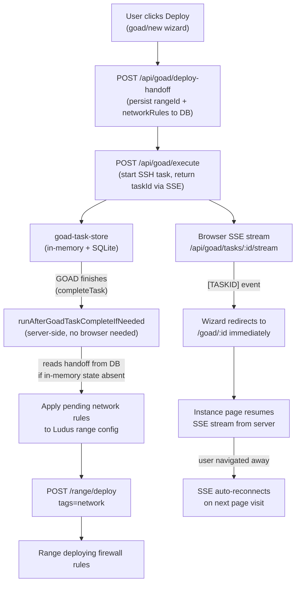

# Architecture

## Stack

| Layer | Technology |
|---|---|
| Framework | Next.js 15 (App Router, React 18) |
| UI | Tailwind CSS, Radix UI (shadcn-style), Lucide |
| Code editor | Monaco (YAML) |
| Terminal/console | noVNC (esbuild bundle) |
| SSH | `ssh2` (server-side only) |
| Database | `better-sqlite3` |
| WebSockets | nginx → Next.js `ws-server.ts` (VNC proxy); TLS at nginx edge |

## Request flow

```
Browser
  │
  ├─ HTTPS :443 ──► nginx (TLS) ──► HTTP :3000 ──► Next.js (App Router) / ws-server.ts
  │                      │                              │
  │                      │                              ├─ /api/proxy/* ──► Ludus API (8080/8081)
  │                      │                              ├─ /api/goad/*  ──► SSH → Ludus server (GOAD)
  │                      │                              ├─ /api/admin/* ──► SSH → Proxmox (pvesh)
  │                      │                              └─ /api/console/* ► SSH → Proxmox (pvesh) + user PAM HTTP for noVNC tickets
  │
  └─ WSS (same origin :443) ──► nginx ──► ws-server.ts ──► Proxmox VNC WebSocket
```

## GOAD task flow

This diagram shows the full lifecycle of a GOAD deploy, including the server-side pending-network workflow that runs after GOAD finishes.



**Key point:** The pending-network workflow runs on the LUX server process — it does not require the browser to stay open. The handoff record persisted in SQLite before the execute call ensures this workflow has the context it needs even after a container restart.

### SSE stream resume

The GOAD log stream (`/api/goad/tasks/:taskId/stream`) replays all existing log lines from disk then streams new ones in real time. This means:
- A user can navigate away and return to find the full log history
- Multiple browser tabs can subscribe to the same task simultaneously
- Admins impersonating a user can also see that user's running tasks

## Key design decisions

- **nginx edge in Compose** — TLS on host **:443**; app container speaks HTTP only on the internal network (`TRUST_PROXY_TLS` preserves secure cookies).
- **No external database** — SQLite under `data/` is the only persistence layer
- **Session-encrypted credentials** — User SSH/PAM password and impersonation API key in an `httpOnly` AES-256-GCM encrypted cookie; never in `sessionStorage`
- **Admin credential hygiene** — Root password, root API key, and stored SSH passwords are not returned to non-admin clients; impersonation API key is not exposed to client-side JavaScript
- **SSE** — Deployment and GOAD logs stream over Server-Sent Events; task list changes are also pushed via a lightweight `/api/goad/tasks/events` stream
- **Task durability** — GOAD task IDs, API keys, and deploy handoff context are persisted to SQLite so workflows survive container restarts
- **Impersonation security** — Both `X-Impersonate-As` and `X-Impersonate-Apikey` headers must be present together to use the header path; partial headers fall back to the session cookie to prevent accidental cross-user credential merges
