# Screenshots

Screenshots follow roughly the same flow as [Features](features.md): range operations first, then infrastructure, snapshots & testing, GOAD, admin, and identity. The hero logo in the main README is [`images/lux_logo_large.jpeg`](../images/lux_logo_large.jpeg); the square mark is at the end of this page.

## Range operations

**Dashboard** — VM table, range state, deploy / abort, deploy logs.

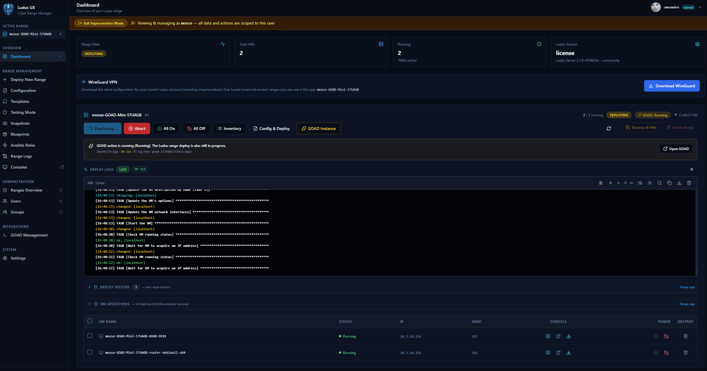

**Range config** — Monaco YAML editor, selective tags, live logs.

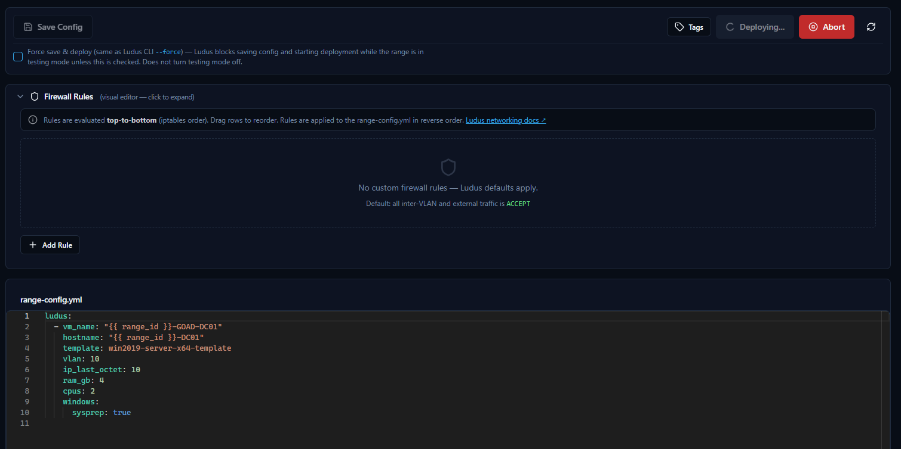

**New range** — wizard / deploy flow.

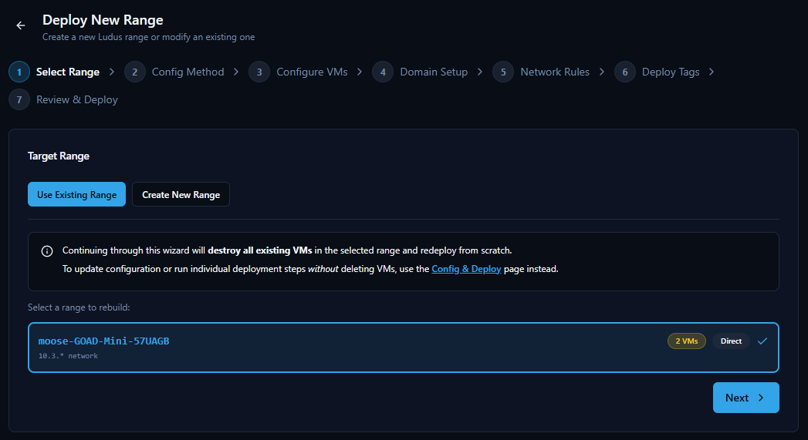

**Range logs** — standalone SSE viewer, download, clear.

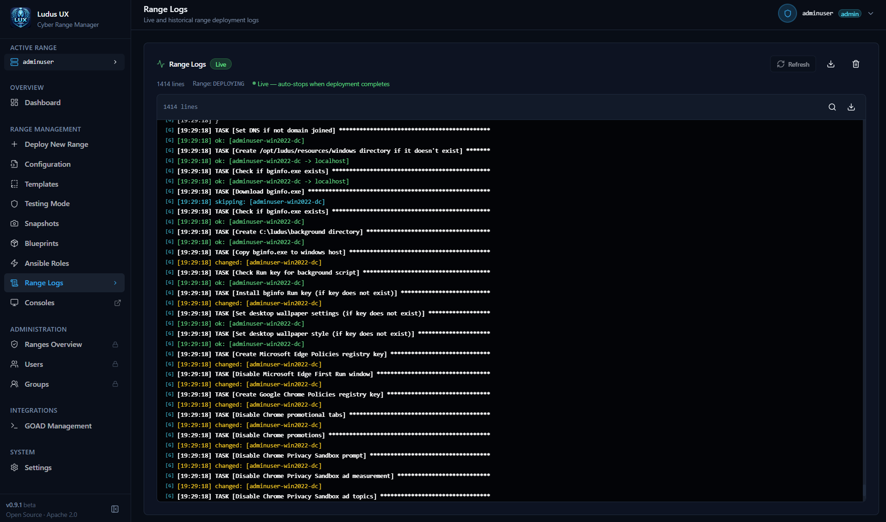

## VM access

**Console in browser** — noVNC session.

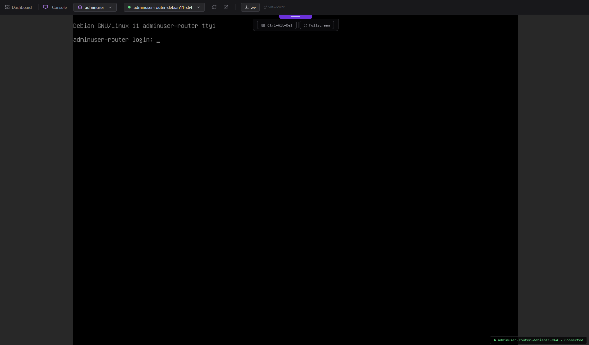

## Infrastructure

**Templates** — Packer templates.

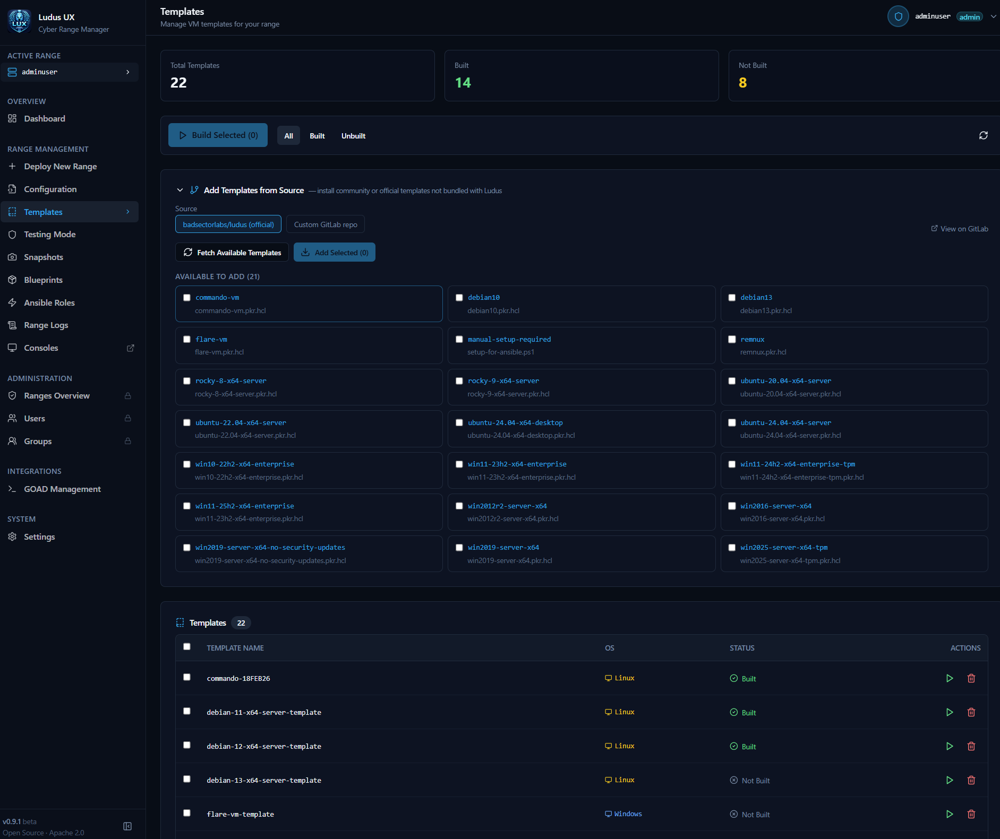

**Blueprints** — save, share, apply configs.

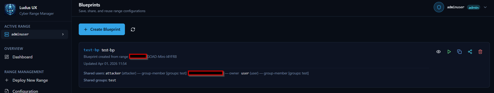

**Ansible roles & collections** — Galaxy-style add / list / remove.

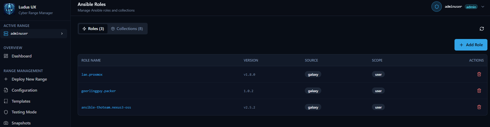

## Snapshots & testing mode

**Snapshots** — per-VM and range-wide snapshot tools.

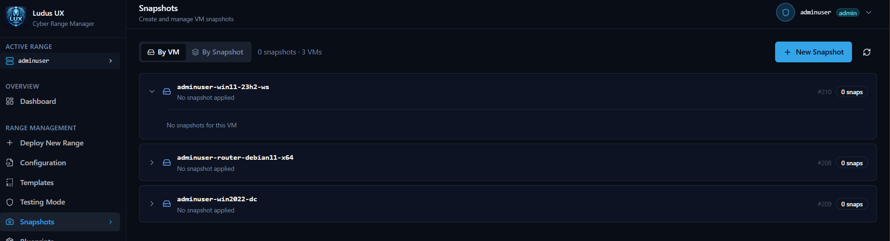

**Testing mode** — disabled, enabled, and in-progress states.

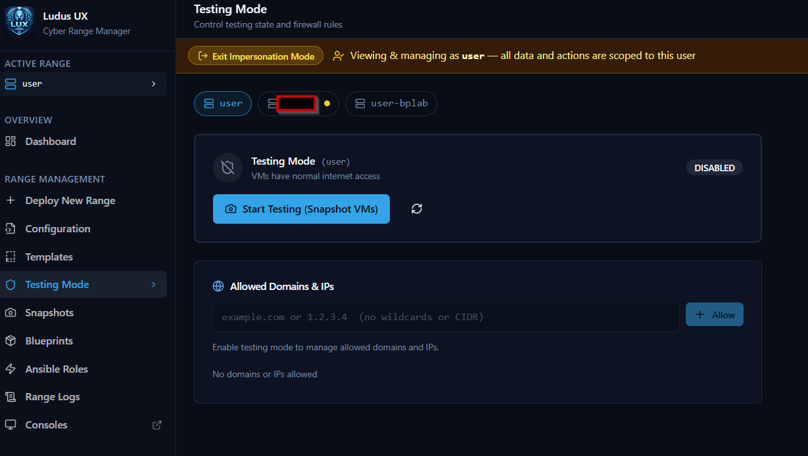

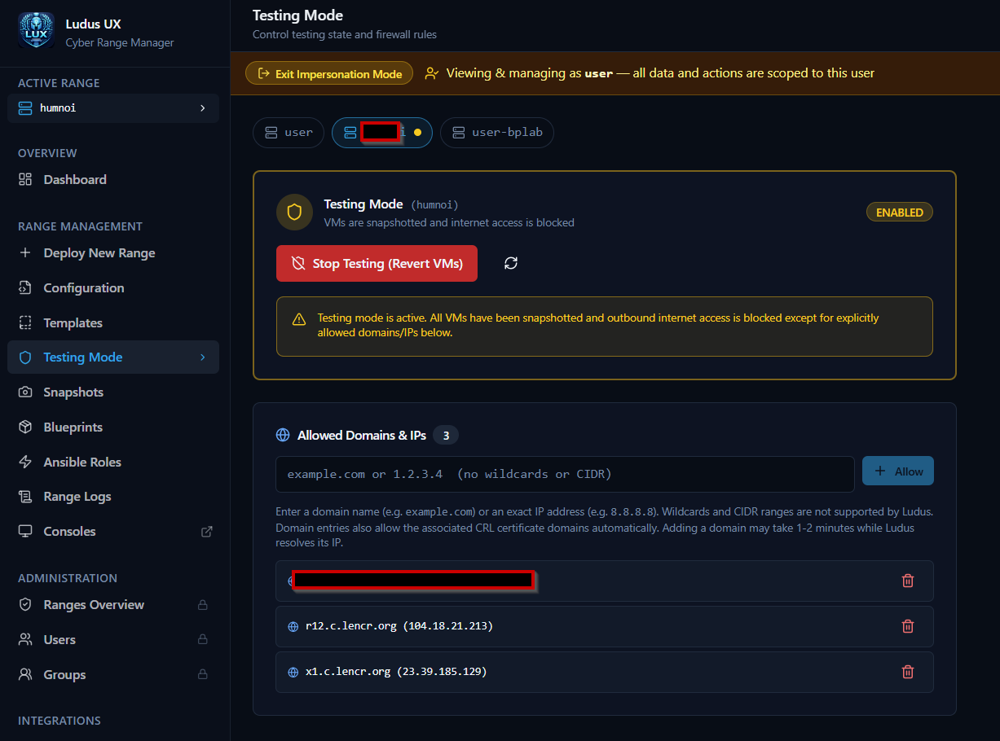

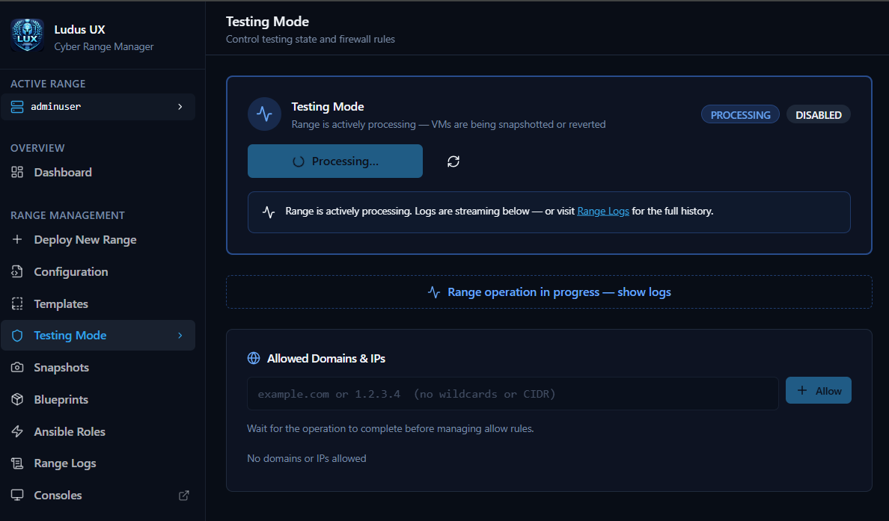

## GOAD & admin

**GOAD** — instances, deploy streams, task history.

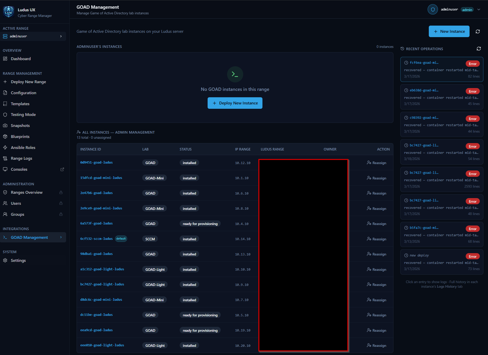

**Ranges overview** — admin-style range list.

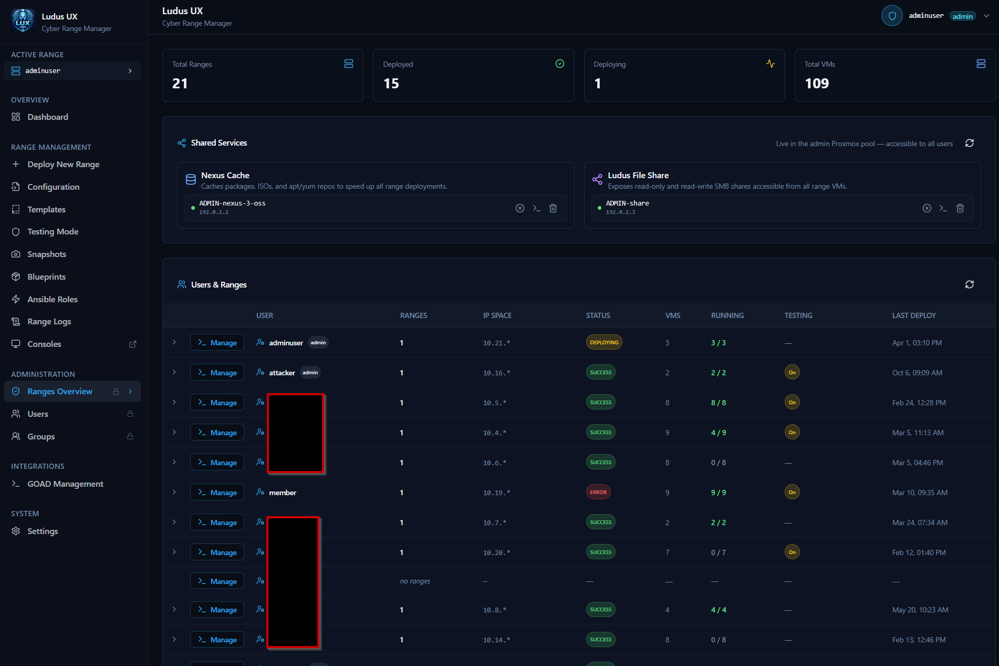

## Users & groups

**Users**

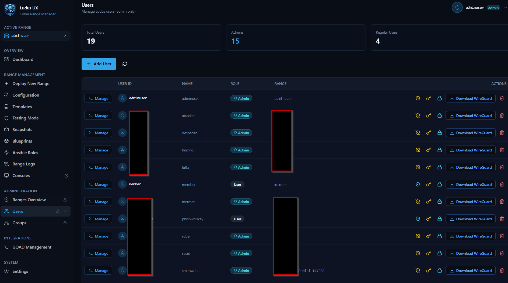

**Groups**

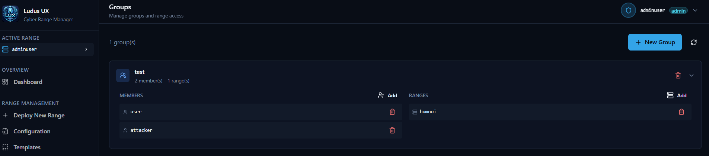

## Branding

**App icon** (JPEG).

