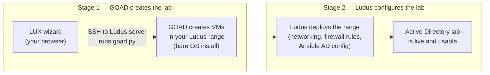

# Workflows

This page explains the two primary workflows in LUX and how they work together. Think of it as the "how does this actually work?" guide for operators — no assumed familiarity with GOAD or Ludus internals required.

---

## What is a Ludus Range?

A **range** is your private lab environment. It is a named collection of virtual machines (VMs) running on the shared Proxmox host. You define which VMs exist by editing a YAML config file; Ludus handles the actual creation, networking, and lifecycle management.

**One range = one isolated network slice of the Proxmox cluster.** Each user owns their own ranges and no one else can access them unless you explicitly share or an admin impersonates you.

**Range states** (plain English):

| State | What it means |
|-------|--------------|
| `NEVER_DEPLOYED` | Fresh range — no VMs have been built yet |
| `DEPLOYING` | Ludus is building or configuring your VMs right now (takes 5–30+ minutes) |
| `WAITING` | Ludus is in the middle of a deploy and waiting on a step |
| `SUCCESS` | Everything built successfully and is running |
| `ERROR` | Something went wrong during the last deploy — check the logs |
| `ABORTED` | You or an admin stopped the deploy in progress |
| `STOPPED` | Range powered off but config is retained |

---

## What is a GOAD Instance?

**GOAD** (Game of Active Directory) is an open-source toolkit that installs pre-configured Active Directory lab environments into your infrastructure. Lab types include **GOAD**, **GOAD-Mini**, **NHA**, **SCCM**, and more.

A **GOAD instance** in LUX is a record of one such installation. It tracks:
- Which lab type (e.g. GOAD-Mini)
- Which extensions are installed (e.g. Exchange, ADCS)
- Which Ludus range it lives in
- The history of every deploy, re-deploy, and action run against it

**One GOAD instance = one lab workspace.** Redeploys reuse the same workspace; you don't create a new instance each time.

---

## How Ludus + GOAD Work Together

This is the most important concept. GOAD and Ludus are two separate systems that LUX coordinates:

**Key point:** When you click **Deploy**, both stages happen automatically and in sequence. You watch both in the Deploy Status tab's live terminal.

- **GOAD's job** — Create the VMs, install Windows, configure the Active Directory domain structure via Ansible
- **Ludus's job** — Apply networking (IP ranges, routing), firewall rules, and any extra Ansible roles you defined in your range config

You do not need to trigger Stage 2 manually. LUX coordinates the handoff.

---

## Deploying a New Lab (step by step)

1. Go to **GOAD → Deploy New Instance**
2. Pick a **lab type** (e.g. GOAD-Mini)
3. Optionally add **extensions** (e.g. Exchange)
4. Optionally configure **firewall rules** — allow/deny specific IPs or domains. You can skip this now and add them later
5. Click **Deploy**

What happens next (automatically):
1. LUX creates a dedicated Ludus range for this lab (named `<you>-<lab>`)
2. The GOAD wizard sends the install command to the Ludus server over SSH
3. The terminal on the Deploy Status tab shows live GOAD output as VMs are created and configured
4. When GOAD finishes, Ludus automatically deploys the range to apply networking and any firewall rules you set
5. Once both stages complete, your lab is live

**The wizard redirects you to the instance page immediately after GOAD starts** — you do not need to stay on the wizard screen. LUX tracks progress server-side and resumes the log stream if you navigate back.

---

## Redeploying an Existing Lab

When you click **Redeploy** on an existing GOAD instance, LUX:
1. **Reuses the same workspace** — your GOAD configuration, instance ID, and range are preserved
2. **Clears the current VMs** in the background so you start with a clean slate
3. **Runs GOAD install** against the existing workspace

Use redeployment to:
- Recover from a broken state (e.g. Ansible failed partway through)
- Apply updated lab templates after a GOAD version upgrade
- Add extensions to an existing install

Redeployment is faster than a fresh deploy because the Ludus range and workspace directories already exist.

---

## The Firewall / Network Rules Queue

If you configure firewall rules in the GOAD wizard, there is an important timing consideration: **GOAD's own install process rewrites the Ludus range config** as it sets up the lab. If LUX applied your rules before GOAD ran, GOAD would overwrite them.

To solve this, LUX uses a **pending-network queue**:

1. When you click Deploy, LUX saves your firewall rules to the server
2. GOAD runs and completes (potentially overwriting the range config)
3. LUX **automatically re-applies your firewall rules** after GOAD finishes, then triggers a final Ludus "network" deploy to enforce them

You do not need to do anything. The Deploy Status tab shows a "Applying network rules..." step when this is happening. The entire process runs on the server — you can safely navigate away.

---

## Admin: Managing Multiple Users (Range Impersonation)

Admins can **view and manage as another user** — seeing their ranges, GOAD instances, and running tasks exactly as that user would. This is called **impersonation**.

**How to activate it:**
1. Open any user's row in the Users or Admin panel
2. Click **Impersonate** (requires entering that user's API key, which admins can read from the Users page)
3. A banner appears at the top of the screen showing who you are impersonating
4. All pages and API calls now run as that user
5. Click **Stop Impersonating** in the banner to return to your own context

**What changes when impersonating:**
- The GOAD instances list shows the other user's labs (not yours)
- Range operations (deploy, abort, config edit) target the other user's ranges
- GOAD deploys create ranges owned by the impersonated user
- All API calls to Ludus use the impersonated user's API key from the session cookie

**What does NOT change:**
- The noVNC console still uses each user's own PAM password — you cannot open another user's VM console unless you know their password
- Your own admin session and capabilities remain active; you can exit impersonation at any time

**Range naming convention:** GOAD ranges are named `<username>-<instanceId>` so it is always clear which user owns a range. When impersonating, new ranges are created under the impersonated user's name.

---

## Server-Side Durability

LUX runs post-deploy coordination (range linkage, firewall rule application) on the server. Even if you:
- Close the browser tab
- Navigate to a different page
- Lose your network connection

...the GOAD install continues on the Ludus server, and LUX's server-side workflow applies your firewall rules and links the new instance to your range when GOAD finishes. You can return to the instance page at any time to see the current status.
